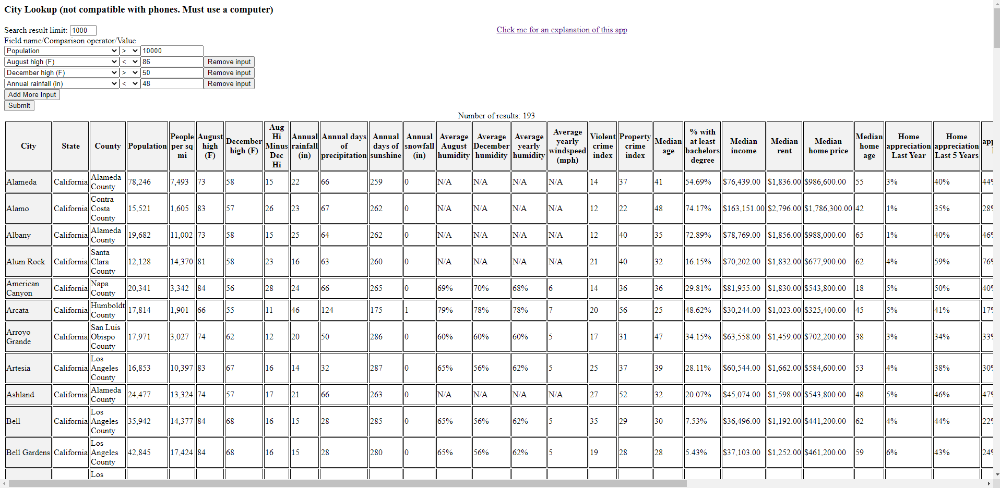
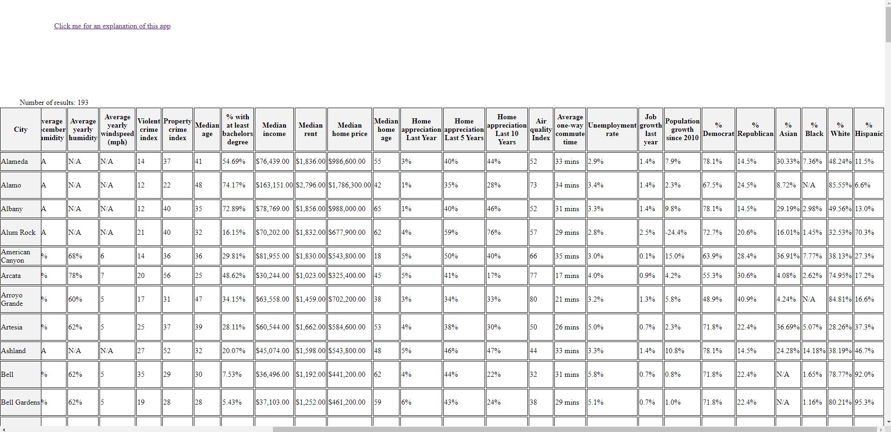

### City lookup
This tool is used to find which cities you might be interested in moving to.

Instead of entering in a city you are interested in and then finding out weather/demographics information for that city, you enter in weather/demographics information that you are interested in and then this tool will generate a list of all cities/towns/CDPs in the USA that satisfy that criteria.

For example, here is how it would look if you want to generate a list of all cities in the USA that have a population greater than 10000, average August High less than 86F, average December high greater than 50F, and an average annual rainfall less than 48 inches:

You can scroll to the right to see for of the columns

This tool does let you enter in a city if you are only interested in seeing results for that city but that's not really the way that this tool is intended to be used.

| Field name | description (if necessary) |
| ----------- | ----------- |
| City      |        |
| State   |    |
| County   |  |
| Population |  |
| People per sq mi |  |
| August high (F) | Average high for the month of August based on historical data |
| December high (F) | Average high for the month of December based on historical data |
| Aug Hi Minus Dec Hi | The average high for the month of August minus the average high for the month of December |
| Annual rainfall (in) | The amount of inches of rain per year based on historical data |
| Annual days of precipitation | |
| Annual days of sunshin | Number of sunny days |
| Annual snowfall (in) | |
| Average August Humidity | The average absolute humidity for the month of August based on historical data |
| Average December Humidity | The average absolute humidity for the month of December based on historical data |
| Average yearly humidity | The average absolute humidity from taking the averages of all 12 months |
| Average yearly windspeed (mph) | The average windspeed from averaging the average windspeeds for all 12 months |
| Violent crime index | On a scale of 1 (lowest) to 100 (highest). This composes of causing physical harm. The US average is 23. |
| Property crime index | On a scale of 1 (lowest) to 100 (highest). This composes of theft. The US average is 35.|

| Comparison operator | Meaning |
| ----------- | ----------- |
| >      | Greater than       |
| >=   | Greater than or equal to   |
| <   | Less than |
| <= | Less than or equal to |
| = | Equal to |
| != | Not equal to |
