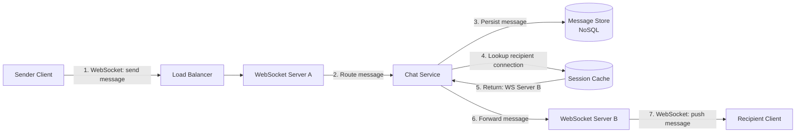
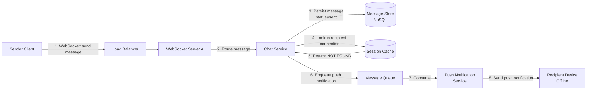
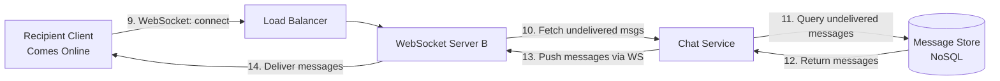
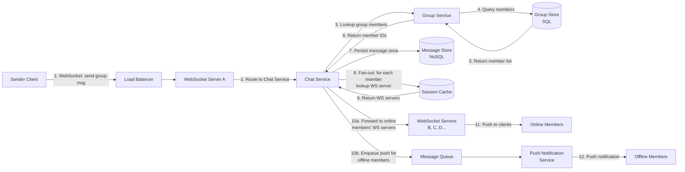
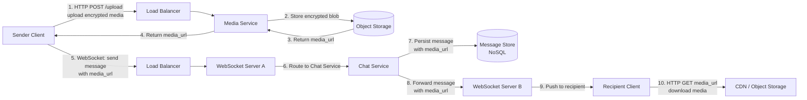
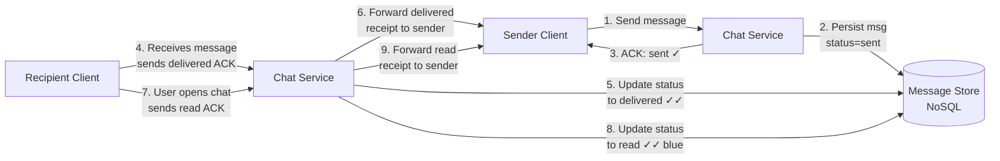
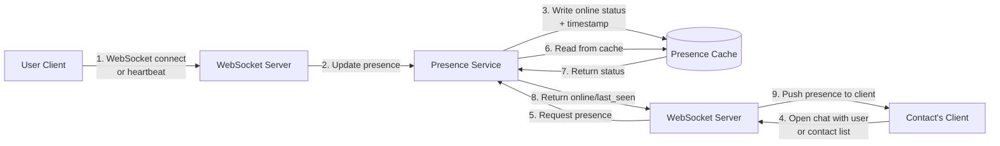
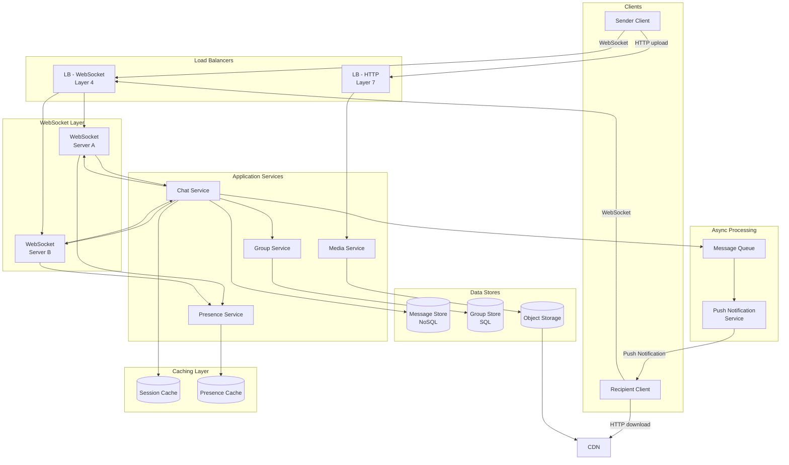

# System Design: WhatsApp

---

## Table of Contents

1. [Functional Requirements](#functional-requirements)
2. [Non-Functional Requirements](#non-functional-requirements)
3. [High-Level Estimation](#high-level-estimation)
4. [Flow 1: One-on-One Messaging (Recipient Online)](#flow-1-one-on-one-messaging-recipient-online)
5. [Flow 2: One-on-One Messaging (Recipient Offline)](#flow-2-one-on-one-messaging-recipient-offline)
6. [Flow 3: Group Messaging](#flow-3-group-messaging)
7. [Flow 4: Media Message Sending](#flow-4-media-message-sending)
8. [Flow 5: Message Receipts (Sent / Delivered / Read)](#flow-5-message-receipts-sent--delivered--read)
9. [Flow 6: Online / Last Seen Status](#flow-6-online--last-seen-status)
10. [Combined Overall Diagram](#combined-overall-diagram)
11. [Database Schema](#database-schema)
12. [CDN Deep Dive](#cdn-deep-dive)
13. [Cache Deep Dive](#cache-deep-dive)
14. [WebSocket Deep Dive](#websocket-deep-dive)
15. [Message Queue Deep Dive](#message-queue-deep-dive)
16. [Push Notification Service Deep Dive](#push-notification-service-deep-dive)
17. [End-to-End Encryption Deep Dive](#end-to-end-encryption-deep-dive)
18. [Load Balancer Deep Dive](#load-balancer-deep-dive)
19. [Scaling Considerations](#scaling-considerations)
20. [Tradeoffs and Deep Dives](#tradeoffs-and-deep-dives)
21. [Alternative Approaches](#alternative-approaches)
22. [Additional Considerations](#additional-considerations)
23. [Vendor Suggestions](#vendor-suggestions)

---

## Functional Requirements

1. **One-on-One Messaging** — Users can send and receive text messages in real time with another user.
2. **Group Messaging** — Users can create groups and send messages visible to all group members.
3. **Media Sharing** — Users can send images, videos, audio clips, and documents.
4. **Message Receipts** — Messages show sent (single checkmark), delivered (double checkmark), and read (blue double checkmark) indicators.
5. **Online / Last Seen Status** — Users can see if a contact is currently online or when they were last active.
6. **Offline Message Delivery** — Messages sent to offline users are stored and delivered when they come back online.
7. **Message Ordering** — Messages within a conversation appear in the correct chronological order.

---

## Non-Functional Requirements

1. **Low Latency** — Messages should be delivered in near real-time (< 200ms for online recipients on same continent).
2. **High Availability** — The system should target 99.99% uptime; messaging is a critical communication tool.
3. **Reliability / Durability** — Zero message loss. Every message sent must eventually be delivered (at-least-once delivery).
4. **Scalability** — Support billions of users and hundreds of billions of messages per day.
5. **Security** — End-to-end encryption so that only sender and recipient can read message contents; the server cannot.
6. **Message Ordering Guarantee** — Messages within a single conversation must be delivered and displayed in the order they were sent.
7. **Consistency** — Eventual consistency is acceptable for presence/status; strong ordering within a conversation.

---

## High-Level Estimation

| Metric | Estimate |
|---|---|
| Total users | ~2 billion |
| Daily active users (DAU) | ~500 million |
| Messages per day | ~100 billion |
| Average message size (text) | ~100 bytes |
| Media messages (% of total) | ~5% |
| Average media file size | ~200 KB |
| Peak concurrent connections | ~200 million |
| Storage per day (text) | ~10 TB |
| Storage per day (media) | ~1 PB |

---

## Flow 1: One-on-One Messaging (Recipient Online)

This flow covers the happy path where both the sender and recipient are connected to the system via WebSocket.



### Examples

**Example 1 — Standard online-to-online message:**
Alice opens her chat with Bob and types "Hey, are you free tonight?" and taps Send. The client sends the encrypted message over Alice's existing WebSocket connection to WebSocket Server A (via the Load Balancer). WebSocket Server A passes the message to the Chat Service, which persists it in the Message Store (NoSQL) with a status of `sent`. The Chat Service then queries the Session Cache to find Bob's WebSocket Server. The Session Cache returns that Bob is connected to WebSocket Server B. The Chat Service forwards the encrypted message to WebSocket Server B, which pushes it down to Bob's client over Bob's WebSocket connection. Bob sees "Hey, are you free tonight?" appear in real time.

**Example 2 — Sender and recipient on the same WebSocket server:**
Alice and Bob happen to be connected to the same WebSocket Server A. The flow is identical, except in step 5 the Session Cache returns WebSocket Server A, and step 6 is a local operation within the same server rather than a network hop to a different WebSocket server.

### Component Deep Dive

| Component | Description |
|---|---|
| **Sender Client** | Mobile or web app. Maintains a persistent WebSocket connection. Encrypts the message using the recipient's public key (E2E encryption) before sending. |
| **Load Balancer** | Distributes incoming WebSocket connections across available WebSocket Servers. Uses consistent hashing or sticky sessions so that reconnections from the same user land on the same server when possible. Operates at Layer 4 (TCP). |
| **WebSocket Server A** | Stateful server holding the sender's WebSocket connection. Receives the raw encrypted message frame, authenticates it via the session token, and forwards it to the Chat Service. |
| **Chat Service** | Core orchestration service. **Protocol:** Internal gRPC. Responsibilities: (1) Write message to the Message Store, (2) Look up recipient's WebSocket Server from Session Cache, (3) Forward message to the correct WebSocket Server. |
| **Message Store (NoSQL)** | Persistent storage for all messages. Partitioned by `conversation_id`, sorted by `created_at` timestamp within each partition. Stores encrypted message blobs. |
| **Session Cache** | In-memory key-value cache mapping `user_id → websocket_server_id`. Updated on connect/disconnect events. Used for O(1) lookup of where a user's connection lives. |
| **WebSocket Server B** | Stateful server holding the recipient's WebSocket connection. Receives the forwarded message from the Chat Service and pushes it to the recipient's client. |
| **Recipient Client** | Decrypts the message using its private key and displays it in the conversation thread. Sends back a `delivered` acknowledgement. |

---

## Flow 2: One-on-One Messaging (Recipient Offline)

This flow covers the case where the recipient does not have an active WebSocket connection.





### Examples

**Example 1 — Recipient offline, comes back online later:**
Alice sends "Happy Birthday!" to Bob, but Bob's phone is off. The Chat Service persists the message with status `sent` and queries the Session Cache for Bob. The cache returns NOT FOUND. The Chat Service enqueues a push notification job onto the Message Queue. The Push Notification Service consumes the job and sends a platform push notification (e.g., "Alice: Happy Birthday!") to Bob's device. Later, Bob turns on his phone and his client re-establishes a WebSocket connection to WebSocket Server B. Upon connection, the Chat Service queries the Message Store for all messages with `status = sent` for Bob's conversations. The undelivered messages are pushed down to Bob's client, and their status is updated to `delivered`.

**Example 2 — Recipient offline, no push notification delivered (no internet at all):**
Same as above, but the push notification also fails because the device has no connectivity. The message remains in the Message Store with `status = sent`. The next time Bob's device connects (could be hours or days later), the sync-on-connect logic retrieves all pending messages and delivers them. No message is ever lost.

### Component Deep Dive

| Component | Description |
|---|---|
| **Chat Service** | Same as Flow 1, but now also handles the "recipient not found" case by enqueuing a push notification job. **Protocol:** Internal gRPC. |
| **Message Queue** | Asynchronous queue that decouples the Chat Service from the Push Notification Service. Ensures push notifications are processed reliably even if the notification service is temporarily down. Messages on the queue contain: `recipient_user_id`, `sender_display_name`, `message_preview` (truncated, *not* the full encrypted body), `conversation_id`. |
| **Push Notification Service** | Consumes from the Message Queue and sends platform-native push notifications (APNs for iOS, FCM for Android). **Protocol:** HTTPS POST to platform push gateways. The notification contains a preview (sender name + truncated plaintext preview set by the client before encryption, or just "New message"). |
| **Sync-on-Connect Logic** | When a client establishes a WebSocket connection, the Chat Service queries the Message Store for all messages with `status = sent` (not yet delivered) addressed to that user, and pushes them down the WebSocket. This is the primary reliability mechanism. |

---

## Flow 3: Group Messaging

This flow covers sending a message to a group chat with N members.



### Examples

**Example 1 — Group message, all members online:**
Alice is in a group "Weekend Hike" with Bob, Charlie, and Diana. Alice sends "Trail starts at 8am!". The Chat Service calls the Group Service to get the member list (Bob, Charlie, Diana). The message is persisted *once* in the Message Store under the group's `conversation_id`. The Chat Service then does a fan-out: it looks up each member's WebSocket server in the Session Cache. Bob is on WS Server B, Charlie on WS Server C, Diana on WS Server D. The Chat Service forwards the message to each of those servers, which push it to each recipient's client.

**Example 2 — Group message, mixed online/offline members:**
Same group, but Diana's phone is off. The Chat Service finds Bob and Charlie in the Session Cache but Diana is NOT FOUND. Bob and Charlie receive the message in real time via their WebSocket connections. For Diana, a push notification job is enqueued on the Message Queue. When Diana comes online later, the sync-on-connect logic delivers the message from the Message Store.

**Example 3 — Large group (256 members):**
Alice sends a message to a group with 256 members. The fan-out is the same but the Chat Service processes it in parallel batches. The message is still stored only *once* in the Message Store (not duplicated per member). The Session Cache lookups are batched. Online members receive the message via their respective WebSocket servers; offline members get push notifications. This write-once, fan-out-on-read approach keeps storage efficient.

### Component Deep Dive

| Component | Description |
|---|---|
| **Group Service** | Manages group metadata (creation, membership, admin roles). **Protocol:** Internal gRPC. **API:** `GetGroupMembers(group_id) → [user_id]`. Reads from the Group Store (SQL). |
| **Group Store (SQL)** | Relational database storing group metadata and membership. SQL is chosen because group membership is relational (many-to-many between users and groups) and benefits from ACID transactions when adding/removing members. |
| **Fan-out Logic (in Chat Service)** | For each group member, the Chat Service looks up the Session Cache. Online members get the message forwarded directly. Offline members get a push notification enqueued. The message itself is stored *only once* in the Message Store with the group `conversation_id` — this avoids duplicating the message N times. |

---

## Flow 4: Media Message Sending

This flow covers sending an image, video, audio, or document.



### Examples

**Example 1 — Sending a photo:**
Alice wants to send Bob a photo of her dog. Her client encrypts the photo locally, then uploads the encrypted blob via `HTTP POST /upload` to the Media Service (through the Load Balancer). The Media Service stores it in Object Storage and returns a `media_url`. Alice's client then sends a regular chat message over her WebSocket connection, but instead of text, the message body contains `{ type: "image", media_url: "https://...", thumbnail_url: "https://...", encryption_key: "<key>" }`. The Chat Service persists this message and forwards it to Bob. Bob's client receives the message, sees it's a media message, uses the `media_url` to download the encrypted blob from the CDN (or Object Storage if the CDN hasn't cached it yet), decrypts it locally, and renders the photo.

**Example 2 — Sending a large video (slow upload):**
Alice sends a 50MB video. The upload to the Media Service takes 30 seconds on her connection. During this time, the chat message is *not* sent yet — the client shows an upload progress bar. Only once the Media Service confirms the upload and returns the `media_url` does the client send the chat message referencing that URL. This two-phase approach (upload first, then send message) keeps the real-time messaging path lightweight and fast.

### Component Deep Dive

| Component | Description |
|---|---|
| **Media Service** | Handles upload and metadata for media files. **Protocol:** HTTP REST. **API:** `POST /upload` — accepts a multipart encrypted blob, stores it in Object Storage, returns `{ media_url, thumbnail_url }`. Also generates thumbnails for images and videos. |
| **Object Storage** | Durable blob storage for media files (images, videos, audio, documents). Stores encrypted blobs. Designed for high throughput writes and reads. |
| **CDN (Content Delivery Network)** | Caches frequently accessed media at edge locations worldwide. When Bob downloads Alice's photo, the CDN serves it from the nearest edge node if cached, reducing latency and offloading Object Storage. *See [CDN Deep Dive](#cdn-deep-dive) for details.* |

---

## Flow 5: Message Receipts (Sent / Delivered / Read)

This flow covers the lifecycle of a message's status indicators.



### Examples

**Example 1 — Full receipt lifecycle (both online):**
Alice sends "See you at 5!" to Bob. (1) The Chat Service persists it with `status = sent` and sends an ACK back to Alice — her client shows a single gray checkmark ✓. (2) Bob's client receives the message and automatically sends a `delivered` acknowledgement to the Chat Service. The Chat Service updates the message status to `delivered` and forwards the receipt to Alice — her client now shows double gray checkmarks ✓✓. (3) Bob actually opens the conversation and reads the message. His client sends a `read` acknowledgement. The Chat Service updates status to `read` and forwards the receipt to Alice — her client shows double blue checkmarks ✓✓.

**Example 2 — Recipient offline, delivery receipt delayed:**
Alice sends "Call me" to Bob who is offline. Alice sees a single checkmark ✓ (sent). When Bob comes online 2 hours later, his client receives the message and immediately sends a `delivered` ACK. Alice (if still online) sees the checkmarks update to ✓✓ in real time. If Alice is now offline, the delivery receipt is stored and she'll see the updated status when she next opens the app.

**Example 3 — Group message receipts:**
Alice sends a message to a group of 5. The message shows ✓ when sent. The Chat Service tracks delivery/read status *per member*. The message shows ✓✓ only when *all* members have received it. The message shows blue ✓✓ only when *all* members have read it. Alice can long-press the message to see individual delivery/read timestamps per member.

### Component Deep Dive

| Component | Description |
|---|---|
| **Receipt Handling (in Chat Service)** | Processes `delivered` and `read` acknowledgements from clients. **Protocol:** WebSocket frames (lightweight, bidirectional). Updates the Message Store and forwards receipt events to the sender's WebSocket. For groups, aggregates per-member receipts before updating the visible status. |
| **Message Status Field** | Enum stored per message in the Message Store: `sent`, `delivered`, `read`. For group messages, there is a separate `message_receipts` table tracking per-member status (see [Schema](#database-schema)). |

---

## Flow 6: Online / Last Seen Status

This flow covers how presence (online/last seen) is tracked and distributed.



### Examples

**Example 1 — User comes online, contact sees "Online":**
Bob opens the WhatsApp app, which establishes a WebSocket connection. The WebSocket Server notifies the Presence Service, which writes `{ user_id: bob, status: online, last_seen: now }` to the Presence Cache. Meanwhile, Alice has her chat with Bob open. Her client had previously subscribed to Bob's presence. The Presence Service detects Bob's status change and pushes an update to Alice's WebSocket: "Bob is Online". Alice sees "Online" under Bob's name.

**Example 2 — User goes offline, contact sees "Last seen":**
Bob closes the app. His WebSocket connection drops. The WebSocket Server notifies the Presence Service, which updates `{ user_id: bob, status: offline, last_seen: 2024-03-15T14:30:00Z }`. Alice's client receives the presence update and now shows "Last seen today at 2:30 PM" under Bob's name.

**Example 3 — Heartbeat-based presence:**
Bob has the app open but is idle. Every 30 seconds, his client sends a heartbeat ping over the WebSocket. The Presence Service updates `last_seen` on each heartbeat. If no heartbeat is received for 60 seconds, the Presence Service marks Bob as offline. This handles cases where the WebSocket drops silently without a clean disconnect (e.g., network loss).

### Component Deep Dive

| Component | Description |
|---|---|
| **Presence Service** | Manages online/offline status for all users. **Protocol:** Internal gRPC. Receives connect/disconnect/heartbeat events from WebSocket Servers. Writes to the Presence Cache. Also supports a lightweight pub/sub model: when Alice opens a chat with Bob, she subscribes to Bob's presence; when Bob's status changes, the Presence Service pushes the update to all subscribers. Only users who are currently viewing the contact list or the specific chat subscribe — this limits the fan-out significantly. |
| **Presence Cache** | In-memory cache storing `user_id → { status, last_seen }`. TTL-based: entries expire after 5 minutes if not refreshed. This ensures stale "online" states are automatically cleaned up if a server crashes without sending disconnect events. |
| **Heartbeat Mechanism** | Client sends a lightweight ping frame every 30 seconds. If the Presence Service doesn't receive a heartbeat within 60 seconds, it marks the user as offline. This is more reliable than relying solely on WebSocket disconnect events, which can be delayed or missed. |

---

## Combined Overall Diagram

This diagram integrates all flows into a single unified view.



### Combined Flow Examples

**Example 1 — Full one-on-one text message with receipts (both online):**
Alice types "Lunch tomorrow?" to Bob and taps Send. Her client encrypts the message and sends it over her WebSocket connection → Load Balancer (Layer 4) → WebSocket Server A → Chat Service. The Chat Service persists the message in the Message Store (NoSQL) with `status = sent` and sends an ACK back through Alice's WebSocket — she sees ✓. The Chat Service queries the Session Cache: Bob is on WebSocket Server B. The message is forwarded to WebSocket Server B → Bob's client. Bob's client auto-sends a `delivered` ACK → Chat Service updates status to `delivered` → forwards the receipt to Alice → she sees ✓✓. Bob opens the chat and reads it → `read` ACK → status updated → Alice sees blue ✓✓. Throughout, the Presence Service shows Alice that Bob is "Online" based on Bob's heartbeats.

**Example 2 — Media message in a group with offline members:**
Alice sends a photo to the "Family" group (Alice, Bob, Charlie, Diana). (1) Her client encrypts the photo and uploads it via `HTTP POST /upload` → Load Balancer (Layer 7) → Media Service → Object Storage → returns `media_url`. (2) Her client sends the chat message (with `media_url`) over WebSocket → Chat Service. (3) Chat Service calls Group Service to get members → queries Group Store (SQL) → returns [Bob, Charlie, Diana]. (4) Chat Service persists the message once in Message Store. (5) Fan-out: Session Cache lookup — Bob and Charlie are online (WebSocket Servers B and C), Diana is offline. (6) Message forwarded to Bob and Charlie's WebSocket Servers in parallel. (7) Push notification enqueued on Message Queue for Diana. (8) Bob's client downloads the photo from the CDN using the `media_url`, decrypts it, and renders it. (9) Diana comes online later, sync-on-connect delivers the message, her client downloads from CDN.

**Example 3 — Offline recipient, eventual delivery:**
Alice sends "Happy New Year!" to Bob at midnight, but Bob's phone is dead. Chat Service persists the message (`status = sent`), Session Cache returns NOT FOUND for Bob. Push notification enqueued and sent — but Bob's device is off, so it's queued by the platform. Alice sees ✓. Two days later, Bob charges his phone. The platform delivers the queued push notification. Bob opens the app → WebSocket connects → sync-on-connect retrieves the message from Message Store → delivered to Bob → `delivered` ACK → Alice (if online) sees ✓✓.

---

## Database Schema

### SQL Tables

#### 1. `users`

| Column | Type | Constraints | Description |
|---|---|---|---|
| `user_id` | UUID | **Primary Key** | Unique user identifier |
| `phone_number` | VARCHAR(20) | UNIQUE, NOT NULL | User's phone number (used for registration) |
| `display_name` | VARCHAR(100) | NOT NULL | User's display name |
| `profile_picture_url` | VARCHAR(500) | NULLABLE | URL to profile picture in Object Storage |
| `public_key` | TEXT | NOT NULL | User's E2E encryption public key |
| `created_at` | TIMESTAMP | NOT NULL | Account creation time |
| `updated_at` | TIMESTAMP | NOT NULL | Last profile update time |

**Why SQL:** User data is highly structured, has clear relational links (users ↔ groups), and benefits from ACID guarantees for operations like registration and profile updates. The dataset is bounded (one row per user) and queried by unique keys.

**Index:** Hash index on `phone_number` — phone number lookups happen during contact sync (when a user's contact list is checked against registered users). Hash index provides O(1) lookup.

**Read:** When a user opens a chat (to display contact name/picture), during contact sync, during registration checks.
**Write:** On user registration, profile updates.

**Sharding:** Shard by `user_id` (hash-based). Phone number lookups can use a separate global secondary index or a lightweight lookup table mapping phone_number → user_id → shard.

---

#### 2. `groups`

| Column | Type | Constraints | Description |
|---|---|---|---|
| `group_id` | UUID | **Primary Key** | Unique group identifier |
| `group_name` | VARCHAR(200) | NOT NULL | Group display name |
| `group_picture_url` | VARCHAR(500) | NULLABLE | Group profile picture URL |
| `created_by` | UUID | **Foreign Key → users.user_id** | Creator of the group |
| `created_at` | TIMESTAMP | NOT NULL | Group creation time |
| `max_members` | INT | NOT NULL, DEFAULT 256 | Maximum group size |

**Why SQL:** Group metadata is relational (linked to users), small in volume, and needs transactional integrity when creating/modifying groups.

**Read:** When a user opens a group chat (to display group name/picture), when listing groups.
**Write:** On group creation, group metadata update (name, picture).

---

#### 3. `group_members`

| Column | Type | Constraints | Description |
|---|---|---|---|
| `group_id` | UUID | **Foreign Key → groups.group_id**, part of **Composite Primary Key** | Group reference |
| `user_id` | UUID | **Foreign Key → users.user_id**, part of **Composite Primary Key** | Member reference |
| `role` | ENUM('admin', 'member') | NOT NULL, DEFAULT 'member' | Member's role in the group |
| `joined_at` | TIMESTAMP | NOT NULL | When the user joined the group |

**Why SQL:** This is a classic many-to-many junction table. Relational databases handle this pattern efficiently with composite primary keys and foreign key constraints. Membership changes need ACID transactions (e.g., removing a member while they're being added).

**Index:** Composite primary key on `(group_id, user_id)`. Additional B-tree index on `user_id` for "list all groups for a user" queries.

**Read:** Every time a group message is sent (to fan out to members), when displaying group info.
**Write:** When a member is added/removed from a group.

**Normalization note:** This table is normalized (separate from `groups` and `users`) to avoid data duplication. A user can be in many groups, and a group has many users. Storing this as a separate junction table is the standard normalized approach for many-to-many relationships.

---

### NoSQL Tables

#### 4. `messages`

| Column | Type | Constraints | Description |
|---|---|---|---|
| `conversation_id` | UUID | **Partition Key** | Identifies the conversation (1:1 or group) |
| `message_id` | UUID | **Sort Key** (time-ordered UUID / ULID) | Unique message ID, lexicographically ordered by time |
| `sender_id` | UUID | NOT NULL | User who sent the message |
| `message_type` | ENUM('text', 'image', 'video', 'audio', 'document') | NOT NULL | Type of message |
| `encrypted_body` | BLOB | NOT NULL | E2E encrypted message content |
| `media_url` | VARCHAR(500) | NULLABLE | URL to media in Object Storage (if media message) |
| `thumbnail_url` | VARCHAR(500) | NULLABLE | Thumbnail URL for media previews |
| `status` | ENUM('sent', 'delivered', 'read') | NOT NULL | Current delivery status |
| `created_at` | TIMESTAMP | NOT NULL | Message creation timestamp |

**Why NoSQL (Wide-Column):** Messages are the highest volume data in the system (~100B/day). The access pattern is highly predictable: "get messages for conversation X, ordered by time." A wide-column store partitioned by `conversation_id` with `message_id` as the sort key handles this perfectly. Write-heavy workload. No complex joins needed. Horizontal scaling via partition key is straightforward.

**Partition Key:** `conversation_id` — all messages in a conversation are co-located on the same partition for efficient range queries.
**Sort Key:** `message_id` (time-ordered UUID / ULID) — messages are automatically sorted chronologically within a partition.

**Read:** When a user opens a conversation (paginated query: `WHERE conversation_id = X ORDER BY message_id DESC LIMIT 50`), during sync-on-connect.
**Write:** Every time a message is sent, every time a message status is updated (delivered/read).

**Sharding:** Automatically partitioned by `conversation_id`. Hot partitions (very active group chats) are handled by the NoSQL store's automatic partition splitting.

---

#### 5. `conversations`

| Column | Type | Constraints | Description |
|---|---|---|---|
| `user_id` | UUID | **Partition Key** | The user whose conversation list this is |
| `conversation_id` | UUID | **Sort Key** | Reference to the conversation |
| `conversation_type` | ENUM('one_on_one', 'group') | NOT NULL | Whether this is a 1:1 or group chat |
| `other_user_id` | UUID | NULLABLE | For 1:1 chats, the other user's ID |
| `group_id` | UUID | NULLABLE | For group chats, the group's ID |
| `last_message_preview` | VARCHAR(200) | NULLABLE | **Denormalized:** preview of last message |
| `last_message_at` | TIMESTAMP | NULLABLE | **Denormalized:** timestamp of last message |
| `unread_count` | INT | NOT NULL, DEFAULT 0 | **Denormalized:** number of unread messages |

**Why NoSQL (Wide-Column):** The conversation list is queried per-user ("show me all my conversations, sorted by most recent message"). This is a per-user partition with conversations sorted by `last_message_at`. High read frequency (every time the user opens the app).

**Denormalization explanation:** `last_message_preview`, `last_message_at`, and `unread_count` are denormalized here from the `messages` table. This avoids an expensive join or secondary query every time the conversation list is loaded. The conversation list is the first screen users see — it must load fast. The tradeoff is that every new message requires a write to both the `messages` table and an update to the `conversations` table, but this write amplification is acceptable given the read-heavy nature of the conversation list.

**Read:** Every time a user opens the app (conversation list screen). Extremely high read frequency.
**Write:** Every time a new message is sent in any conversation the user belongs to (to update `last_message_preview`, `last_message_at`, `unread_count`).

---

#### 6. `message_receipts` (for group messages)

| Column | Type | Constraints | Description |
|---|---|---|---|
| `message_id` | UUID | **Partition Key** | The message this receipt is for |
| `user_id` | UUID | **Sort Key** | The group member |
| `status` | ENUM('sent', 'delivered', 'read') | NOT NULL | Per-member delivery status |
| `updated_at` | TIMESTAMP | NOT NULL | When the status was last updated |

**Why NoSQL:** High write volume (every group message generates N receipt updates). Simple key-value/wide-column access pattern: "get all receipts for message X." No joins needed.

**Read:** When a user long-presses a group message to see individual read receipts (infrequent).
**Write:** Every time a group member's client sends a `delivered` or `read` ACK for a group message (very frequent).

---

## CDN Deep Dive

### Why a CDN is Appropriate

Media files (images, videos, documents) are large (KB to MB range) and requested by recipients who may be geographically distant from the Object Storage origin. A CDN caches media at edge locations worldwide, providing:

- **Reduced latency** — Bob downloads Alice's photo from a nearby edge node instead of crossing an ocean.
- **Reduced load on Object Storage** — Popular media (e.g., a group photo downloaded by 256 members) is served from cache.
- **Bandwidth savings** — Edge caching reduces egress from the origin data center.

### CDN Strategy

| Aspect | Strategy | Reasoning |
|---|---|---|
| **Content cached** | Media files only (images, videos, audio, documents). NOT text messages (which are tiny and delivered via WebSocket). | Text messages are real-time, small, and go through WebSockets. Only large static blobs benefit from CDN caching. |
| **Cache population** | Pull-based (lazy/on-demand). The CDN fetches from Object Storage on the first request for a given `media_url`, then caches it at the edge. | Push-based would be wasteful — many media files are only ever downloaded by one recipient (1:1 chats). |
| **Eviction policy** | LRU (Least Recently Used) | Media access follows a temporal pattern — recently sent media is frequently accessed, older media is rarely re-downloaded. LRU naturally keeps hot content cached. |
| **Expiration (TTL)** | 30 days | Media in WhatsApp is typically accessed within hours or days of being sent. A 30-day TTL covers the vast majority of access patterns while allowing cold media to be evicted. After TTL, the CDN re-fetches from Object Storage on the next request. |
| **Security** | Signed URLs with expiration. The Media Service generates a time-limited signed URL that the CDN validates. | Since media is E2E encrypted, the CDN stores and serves encrypted blobs. Even if the CDN is compromised, the data is unreadable without the recipient's private key. Signed URLs prevent unauthorized access to the encrypted blobs. |

### CDN is NOT used for:

- **Text messages** — Too small, real-time, and delivered via WebSocket. CDN adds unnecessary latency for tiny payloads.
- **Presence data** — Ephemeral, changes frequently, served from in-memory cache.
- **User profiles** — Could use CDN for profile pictures (same strategy as media), but profile metadata (name, phone) is served from the User Service.

---

## Cache Deep Dive

The system uses two in-memory caches, each with a distinct purpose.

### 1. Session Cache

| Aspect | Strategy | Reasoning |
|---|---|---|
| **Purpose** | Maps `user_id → websocket_server_id` for routing messages to the correct WebSocket server | Every message sent requires a lookup of the recipient's WebSocket server. This must be extremely fast (sub-millisecond). |
| **Caching strategy** | Write-through. When a WebSocket connection is established, the WebSocket Server writes `{ user_id: X, ws_server_id: Y }` to the cache synchronously before accepting messages. On disconnect, the entry is deleted. | Write-through ensures the cache is always up-to-date. Since connection events (connect/disconnect) are the source of truth, writing through on these events guarantees consistency. |
| **Eviction policy** | No eviction. Entries are explicitly deleted on disconnect. | The cache size is bounded by the number of concurrent connections (~200M), and each entry is tiny (~100 bytes). Total cache size: ~20 GB — easily fits in memory. Entries shouldn't be evicted while the connection is active. |
| **Expiration (TTL)** | 5 minutes (safety net). If a WebSocket server crashes without sending disconnect events, entries expire after 5 minutes. The heartbeat mechanism refreshes the TTL. | Without TTL, a server crash could leave stale entries permanently. The 5-minute TTL acts as a cleanup mechanism. Heartbeats from the client keep the entry alive. |
| **Population** | Populated on WebSocket connection establishment. Refreshed on heartbeat. Deleted on disconnect. | The write path is clean: connect → write, heartbeat → refresh TTL, disconnect → delete. |

### 2. Presence Cache

| Aspect | Strategy | Reasoning |
|---|---|---|
| **Purpose** | Maps `user_id → { status: online/offline, last_seen: timestamp }` for presence queries | When Alice opens her chat with Bob, she needs to see Bob's online status immediately. |
| **Caching strategy** | Write-through. The Presence Service writes to the cache on every connect, disconnect, and heartbeat event. | Presence data is ephemeral and changes frequently. Write-through keeps it current. |
| **Eviction policy** | LRU with a max capacity. | Most users are offline at any given time. LRU keeps active users' presence in cache and evicts stale entries for long-inactive users. |
| **Expiration (TTL)** | 5 minutes. If no heartbeat refreshes the entry, it expires, and the user is considered offline. | This is the core mechanism for detecting silent disconnects (e.g., user's network drops without a clean WebSocket close). |
| **Population** | Written on connect/disconnect/heartbeat. Read on presence queries from contacts. | High write frequency (~200M entries updated every 30 seconds via heartbeats). High read frequency (every time a user opens a chat or scrolls through their contact list). |

### Why an In-Memory Cache?

Both caches require sub-millisecond lookups on the critical path of message delivery. Reading from disk-based storage would add unacceptable latency to every message. The data is ephemeral (connections and presence are transient) and bounded in size, making it a perfect fit for in-memory caching.

---

## WebSocket Deep Dive

### Why WebSocket?

Real-time messaging requires bidirectional, low-latency communication. The alternatives are:

| Approach | Why NOT chosen |
|---|---|
| **HTTP Long Polling** | Each "receive" requires a new HTTP request after the previous one returns. Overhead of HTTP headers on every request. Higher latency. Does not scale well to billions of users. |
| **Server-Sent Events (SSE)** | Unidirectional (server → client only). Sending a message would require a separate HTTP request. Two separate channels increase complexity. |
| **HTTP Short Polling** | Client repeatedly polls the server (e.g., every second). Enormous wasted bandwidth. Unacceptable latency (up to 1 second delay). At 500M DAU polling every second, that's 500M requests/second for *nothing* most of the time. |

**WebSocket** provides full-duplex communication over a single TCP connection, with minimal framing overhead (2-14 bytes per frame vs. hundreds of bytes for HTTP headers). Once established, the connection stays open for the duration of the session.

### Connection Lifecycle

1. **Connection Establishment:**
   - Client sends an HTTP Upgrade request to the Load Balancer.
   - Load Balancer (Layer 4, TCP) routes to a WebSocket Server using consistent hashing on the client's `user_id` (extracted from the auth token).
   - WebSocket Server completes the HTTP → WebSocket upgrade handshake.
   - WebSocket Server authenticates the client using the session token.
   - WebSocket Server registers the connection in the Session Cache: `{ user_id → ws_server_id }`.
   - WebSocket Server notifies the Presence Service: user is online.

2. **Active Connection:**
   - Messages are sent/received as WebSocket frames (binary frames for encrypted message payloads).
   - Client sends heartbeat pings every 30 seconds.
   - WebSocket Server responds with pong frames and refreshes the Session Cache TTL.

3. **Disconnection:**
   - Clean disconnect: Client sends a WebSocket Close frame. Server removes the entry from Session Cache and notifies Presence Service.
   - Unclean disconnect: Server detects TCP connection loss (no heartbeat for 60 seconds). Server removes the Session Cache entry and notifies Presence Service.

### Connection Storage

Each WebSocket Server holds connections in-memory as a mapping of `user_id → WebSocket connection object`. A single server can hold ~500K-1M concurrent connections (limited by file descriptors and memory — each connection uses ~10-20 KB of memory for buffers).

### Routing Messages to Other WebSocket Servers

When the Chat Service needs to send a message to a user on a *different* WebSocket Server:
1. Chat Service looks up `user_id → ws_server_id` in the Session Cache.
2. Chat Service sends the message to the target WebSocket Server via **internal gRPC** (fast, binary, multiplexed).
3. The target WebSocket Server pushes the message to the recipient's WebSocket connection.

This is a server-to-server hop, adding ~1-5ms of latency.

---

## Message Queue Deep Dive

### Why a Message Queue?

The Message Queue decouples the Chat Service from the Push Notification Service. Without it:
- If the Push Notification Service is down, the Chat Service would either block (unacceptable latency for the sender) or drop the notification (unacceptable reliability).
- The Chat Service's throughput would be bound by the notification service's throughput.

With the Message Queue:
- The Chat Service enqueues a notification job in microseconds and moves on.
- The Push Notification Service consumes jobs at its own pace, with retries and backoff.
- If the Push Notification Service is temporarily down, jobs accumulate in the queue and are processed when it recovers.

### Why Not Pub/Sub?

A Pub/Sub system is optimized for broadcasting the same event to multiple subscribers. Push notifications are point-to-point (one notification to one user's device). A Message Queue with work-queue semantics (each message consumed by exactly one worker) is the right abstraction.

### How Messages Flow Through the Queue

1. **Producing:** The Chat Service does `enqueue({ recipient_user_id, sender_display_name, message_preview, conversation_id, platform })`. This is a fast, non-blocking operation.
2. **Queue storage:** Messages are durably stored in the queue (persisted to disk). If the queue crashes, messages are not lost.
3. **Consuming:** Push Notification Service workers poll the queue (or use a push-based consumer). Each worker takes a job, sends the push notification via the platform's push gateway (APNs/FCM), and ACKs the job. If the worker crashes before ACKing, the job becomes visible again after a visibility timeout and is picked up by another worker.
4. **Retry:** If the push gateway returns an error (e.g., rate limit), the worker NACKs the job, and it's retried with exponential backoff.
5. **Dead letter queue:** After N failed retries, the job is moved to a dead letter queue for manual inspection.

### Message Format on Queue

```json
{
  "recipient_user_id": "uuid-bob",
  "sender_display_name": "Alice",
  "message_preview": "Hey, are you free ton...",
  "conversation_id": "uuid-conv-123",
  "platform": "ios",
  "device_token": "apns-token-xyz",
  "attempt": 1,
  "enqueued_at": "2024-03-15T14:30:00Z"
}
```

---

## Push Notification Service Deep Dive

### Purpose

Sends platform-native push notifications to devices when the recipient is offline. This is the fallback delivery mechanism when WebSocket delivery is not possible.

### Protocol

- **Inbound:** Consumes jobs from the Message Queue.
- **Outbound:** `HTTPS POST` to platform push gateways (APNs for iOS, FCM for Android).

### Behavior

1. Receives a notification job from the queue.
2. Constructs a platform-specific push payload (title: sender name, body: message preview or "New message").
3. Sends via HTTPS POST to the appropriate platform gateway.
4. On success: ACKs the job on the queue.
5. On failure: NACKs for retry (transient errors) or discards (permanent errors like invalid device token — also updates the device token registry).

### Important Note on E2E Encryption

The push notification preview may contain a truncated plaintext preview *set by the sender's client* before encryption, OR it can simply say "New message from [sender]" for maximum privacy. This is a user setting. The *full* encrypted message body is never sent through push notifications — it's only retrievable from the Message Store via the WebSocket sync-on-connect flow.

---

## End-to-End Encryption Deep Dive

### How It Works

1. Each user generates a public/private key pair on device registration. The public key is uploaded to the server (`users.public_key`).
2. When Alice wants to message Bob, her client fetches Bob's public key from the server.
3. Alice's client encrypts the message with Bob's public key. Only Bob's private key (which never leaves his device) can decrypt it.
4. The server stores and forwards the encrypted blob without ever being able to read it.
5. For group messages, the sender encrypts the message with a shared group key, distributed to members via the Signal Protocol's group key exchange.

### Implications for System Design

- The server stores `encrypted_body` blobs — it cannot index, search, or analyze message content.
- Media is encrypted client-side before upload, so the Object Storage and CDN store encrypted blobs.
- Push notification previews must be set by the client before encryption (or omitted for privacy).

---

## Load Balancer Deep Dive

### Where Load Balancers Are Placed

1. **LB - WebSocket (Layer 4, TCP):** In front of WebSocket Servers.
2. **LB - HTTP (Layer 7):** In front of the Media Service (and other HTTP APIs if any).

### Load Balancer 1: WebSocket (Layer 4)

| Aspect | Details |
|---|---|
| **Layer** | Layer 4 (TCP). Does NOT inspect HTTP content. |
| **Why Layer 4?** | WebSocket connections are long-lived TCP connections. Layer 7 LBs are designed for short-lived HTTP request-response cycles and add overhead for connection upgrades. Layer 4 simply routes TCP streams. |
| **Algorithm** | Consistent hashing on `user_id` (extracted from the connection metadata or auth token during initial handshake). This ensures reconnections from the same user land on the same server when possible, minimizing Session Cache churn. |
| **Health checks** | TCP health checks to WebSocket Servers every 10 seconds. Unhealthy servers are removed from the pool. |
| **Scaling** | Multiple LB instances in an active-active configuration behind DNS round-robin or an anycast IP. |

### Load Balancer 2: HTTP (Layer 7)

| Aspect | Details |
|---|---|
| **Layer** | Layer 7 (HTTP). Inspects HTTP headers and paths. |
| **Why Layer 7?** | Media uploads need content-aware routing (e.g., large uploads to servers with more memory, rate limiting per user). Layer 7 allows path-based routing and request inspection. |
| **Algorithm** | Round-robin with least-connections. Media uploads are large and variable-duration, so least-connections avoids overloading servers that are processing large uploads. |
| **Health checks** | HTTP health checks (`GET /health`) to Media Service instances every 10 seconds. |
| **SSL termination** | TLS is terminated at this LB. Internal traffic between LB and Media Service uses plain HTTP (within a trusted network). |

---

## Scaling Considerations

### Horizontal Scaling

| Component | Scaling Strategy |
|---|---|
| **WebSocket Servers** | Scale horizontally by adding more servers. Each server is stateless in terms of persistent data (connections are ephemeral). The Session Cache tracks which user is where. At ~500K connections per server, 200M concurrent users require ~400 WebSocket servers. |
| **Chat Service** | Stateless; scale horizontally behind internal load balancers. |
| **Group Service** | Stateless; scale horizontally. Cache hot group memberships. |
| **Presence Service** | Scale horizontally. Partition presence subscriptions by user ID ranges. |
| **Media Service** | Stateless; scale horizontally behind the HTTP Load Balancer. |
| **Push Notification Service** | Scale by adding more queue consumers. Throughput scales linearly with workers. |
| **Message Store (NoSQL)** | Horizontally partitioned by `conversation_id`. Add nodes to increase capacity. |
| **Group Store (SQL)** | Shard by `group_id` if needed, but group metadata is relatively small. Read replicas for read scaling. |
| **Session Cache** | Partition by `user_id` hash across a cache cluster. Each node holds a subset of user-to-server mappings. |
| **Presence Cache** | Same as Session Cache — partitioned by `user_id` hash. |

### Load Balancers for Scale

- **WebSocket LB (Layer 4):** Multiple active-active instances behind DNS/anycast. Handles millions of concurrent connections.
- **HTTP LB (Layer 7):** Multiple instances for media upload/download. Auto-scales based on request rate.

### Geographic Distribution

- Deploy WebSocket Servers, Chat Service, and caches in multiple geographic regions (e.g., US-East, Europe-West, Asia-Pacific).
- Messages between users in the same region stay within that region.
- Messages between users in different regions route through the nearest data center with cross-region replication of the Message Store.

### Message Store Scaling

- The Message Store is the highest-volume component (~100B writes/day).
- Partition by `conversation_id` to distribute load.
- Time-series compaction: messages older than N days can be archived to cold storage to keep the active dataset manageable.
- A conversation with the partition key design means a single partition holds an entire conversation's history, enabling efficient range scans.

### Hot Partition Mitigation

- Most conversations are between two people with moderate message volume — partitioning by `conversation_id` distributes load evenly.
- For viral group chats (e.g., 256 members, high message rate), the NoSQL store's automatic partition splitting handles the increased throughput.

---

## Tradeoffs and Deep Dives

### 1. Fan-Out on Write vs. Fan-Out on Read (Group Messages)

**Chosen: Fan-Out on Read (Write Once, Read Fan-Out)**
- The message is stored *once* under the group's `conversation_id`.
- When each member opens the group chat, they read from the same partition.

**Why not Fan-Out on Write (copy the message to each member's inbox)?**
- A 256-member group would require 256 copies of every message — enormous write amplification.
- WhatsApp groups are capped at 1024 members, but even at 256, this is wasteful.
- The tradeoff: read latency is slightly higher (reading from a shared group partition rather than a personalized inbox), but the write savings are massive.

### 2. Message Ordering

**Challenge:** Network delays, server clock drift, and concurrent messages can cause ordering issues.

**Solution:**
- Use time-ordered UUIDs (ULIDs) generated by the *client* (using the sender's local timestamp + random component).
- The server validates that timestamps are within a reasonable window (±30 seconds from server time).
- Within a conversation partition, messages are sorted by `message_id` (ULID), which provides chronological ordering.
- For 1:1 chats, this is sufficient. For group chats, minor reordering (within a few seconds) is acceptable.

### 3. Sync-on-Connect vs. Push Every Missed Message

**Chosen: Sync-on-Connect**
- When a client connects, it sends its "last known `message_id`" per conversation.
- The server returns all messages after that ID.
- This is more reliable than relying solely on push notifications (which can be dropped by the OS).

### 4. Encrypted Storage

**Tradeoff:** The server cannot perform server-side search, spam detection, or content moderation on encrypted messages.
- This is an intentional privacy-first tradeoff.
- Spam detection relies on metadata (message rate, user reports) rather than content analysis.

### 5. Denormalized Conversation List

**Tradeoff:** Writing a message requires updating both the `messages` table and the `conversations` table (write amplification).
- Benefit: The conversation list (most frequently accessed screen) loads in a single partition scan without joining to the messages table.
- At the scale of WhatsApp, this read optimization is critical.

---

## Alternative Approaches

### 1. HTTP Long Polling Instead of WebSockets

**Why not chosen:** Long polling requires a new HTTP connection for every message receive cycle. At 500M DAU, this creates enormous connection churn and HTTP overhead. WebSocket's persistent connection with minimal framing overhead is far more efficient for real-time messaging.

### 2. Pub/Sub for Message Delivery (Instead of Direct WebSocket Routing)

**Approach:** Each user subscribes to a topic (e.g., `user/{user_id}/messages`). Senders publish to the recipient's topic.

**Why not chosen:**
- Adds an extra hop (message → pub/sub broker → WebSocket server → client) compared to direct routing (message → look up WebSocket server → push to client).
- Pub/Sub is great for broadcasting to many subscribers but adds unnecessary overhead for 1:1 messaging where there is exactly one subscriber.
- The Session Cache + direct server-to-server routing approach is simpler and lower latency for WhatsApp's predominantly 1:1 traffic.

### 3. Store Messages in SQL Instead of NoSQL

**Why not chosen:**
- ~100B messages/day exceeds the practical write throughput of a single SQL instance.
- Messages have a simple access pattern (partition by conversation, sort by time) that doesn't require SQL's relational features.
- SQL's ACID overhead is unnecessary for append-only, immutable message storage.
- NoSQL (wide-column) provides horizontal scaling, fast partition scans, and handles the write-heavy workload.

### 4. XMPP Protocol Instead of Custom WebSocket Protocol

**XMPP** is an open standard for messaging (originally used by WhatsApp in early versions).

**Why not chosen for this design:**
- XMPP is XML-based, leading to verbose payloads (significant bandwidth overhead at scale).
- A custom binary protocol over WebSocket is more efficient and gives full control over frame format, compression, and encryption integration.
- XMPP's federation model is unnecessary for a single-platform system.

### 5. Each User Has Their Own Inbox (Write-Fan-Out for All Messages)

**Approach:** Every message (1:1 or group) is copied to each recipient's personal inbox table, partitioned by `user_id`.

**Why not chosen:**
- For 1:1 messages, this means 2 copies of every message (one for each user's inbox).
- For group messages with 256 members, this means 256 copies.
- Massive write amplification.
- The conversation-partitioned approach stores each message once and is more storage-efficient, at the cost of slightly more complex read fan-out for the conversation list (which we mitigate with the denormalized `conversations` table).

---

## Additional Considerations

### Message Expiration / Disappearing Messages

- Support for messages that auto-delete after a configurable duration (24 hours, 7 days, 90 days).
- Implemented as a TTL on the message record in the NoSQL store, or a background cleanup job that deletes expired messages.
- The client also deletes messages locally based on the expiration timestamp.

### Multi-Device Support

- A user may be logged in on multiple devices (phone + web + desktop).
- Each device maintains its own WebSocket connection registered in the Session Cache: `user_id + device_id → ws_server_id`.
- When a message is received, it's fanned out to all of the user's connected devices.

### Backup and Restore

- WhatsApp allows cloud backups of chat history (to the user's own cloud storage account).
- This is a client-side feature — the client uploads encrypted backups. The server does not store backup copies.

### Rate Limiting

- Rate limiting on the Chat Service to prevent spam: e.g., max 100 messages/minute per user.
- Rate limiting on the Media Service: e.g., max 50 uploads/hour per user.
- Implemented at the Load Balancer (Layer 7) and/or at the service level.

### Message Delivery Guarantees

- **At-least-once delivery:** A message may be delivered more than once (e.g., if the ACK is lost). Clients deduplicate by `message_id`.
- **Ordering guarantee:** Within a conversation, messages are ordered by `message_id` (ULID). Clients display messages in this order.

---

## Vendor Suggestions

| Component | Potential Vendors |
|---|---|
| **NoSQL (Wide-Column) for Messages** | Apache Cassandra, ScyllaDB, Amazon DynamoDB, Google Cloud Bigtable |
| **SQL for Users/Groups** | PostgreSQL, MySQL, Amazon Aurora, Google Cloud Spanner |
| **In-Memory Cache** | Redis, Memcached, Amazon ElastiCache |
| **Message Queue** | Apache Kafka, RabbitMQ, Amazon SQS, Apache Pulsar |
| **Object Storage** | Amazon S3, Google Cloud Storage, Azure Blob Storage, MinIO |
| **CDN** | Cloudflare, Amazon CloudFront, Akamai, Fastly |
| **Push Notification Gateways** | Apple APNs, Google FCM (required for iOS/Android) |
| **Load Balancer** | HAProxy, NGINX, Amazon ALB/NLB, Envoy |
| **WebSocket Framework** | Netty (Java), uWebSockets (C++), Socket.IO (Node.js) |
| **Encryption Protocol** | Signal Protocol (used by WhatsApp in production) |
